# Assignment 

## How to run

1. clone this repo
2. cd answers
3. take 7_1 for example, run "python3 7_1.py"

## Answers screenshots

1. 7_1.py

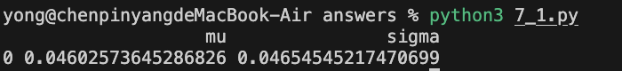

2. 7_2.py

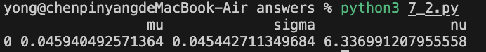

3. 7_3.py

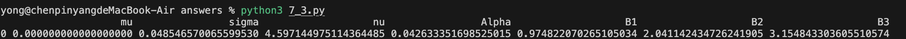

4. 1_1.py

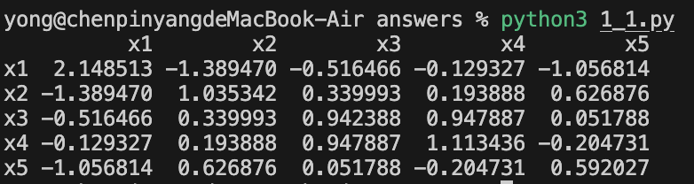

5. 1_2.py

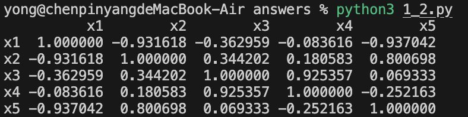

6. 1_3.py

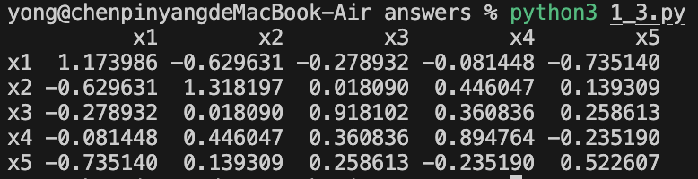

7. 1_4.py

8. 2_1.py

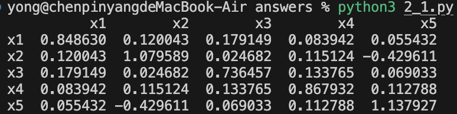

9. 2_2.py

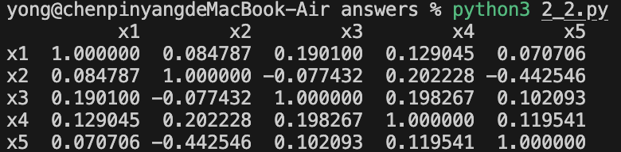

10. 2_3.py

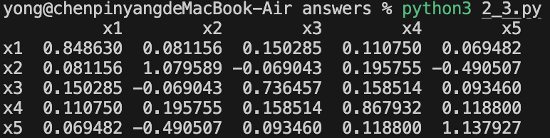

11. 3_1.py

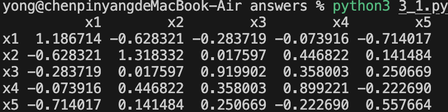

12. 3_2.py

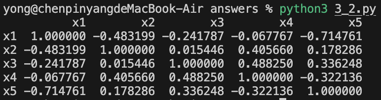

13. 3_3.py

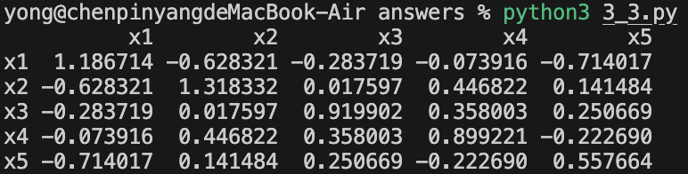

14. 3_4.py

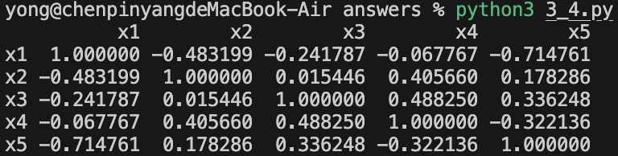

15. 4_1.py

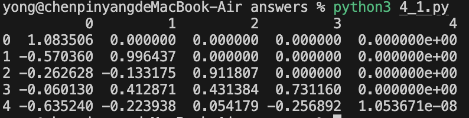

16. 6_1.py

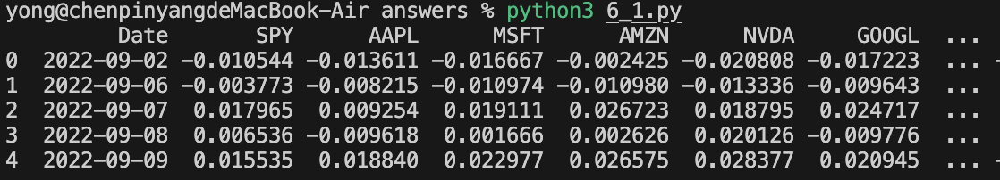

17. 6_2.py

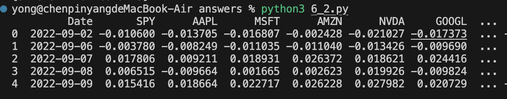
